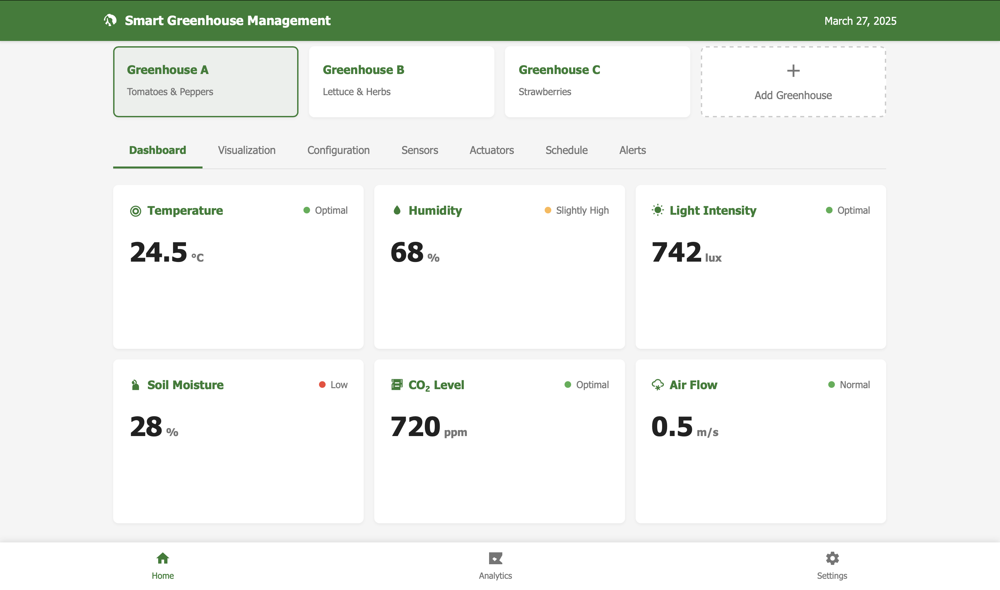
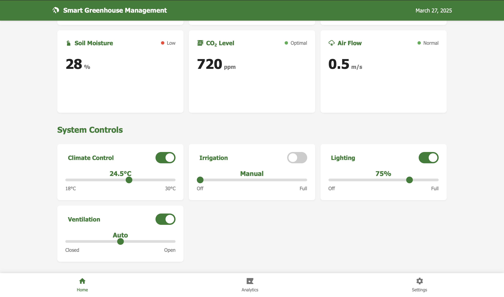

# Web Smart Farm Platform

Welcome to the Web Smart Farm Platform repository. This project demonstrates a modern, responsive web application for monitoring and managing smart farming operations.

## Features

- Real-time charts and analytics
- Sensor and actuator management
- Greenhouse data visualization
- Modular design with easy integrations

## Installation

1. Clone the repository:
   ```bash
   git clone https://github.com/yourusername/web-smart-farm-dev.git
   ```
2. Open the project in Visual Studio Code.
3. Install any required dependencies.
4. Launch the application using your preferred local server.

## Usage

- Navigate through tabs to access different functionalities.
- Use the forms and modals to add new sensors, actuators, or greenhouses.
- View dynamic charts to monitor your farm's performance.

## Screenshots

Below are some example screenshots of the application:

### Dashboard




## Contributing

Contributions are welcome! Please open an issue or submit a pull request for any bugs or enhancements.

## License

This project is open source under the MIT License.